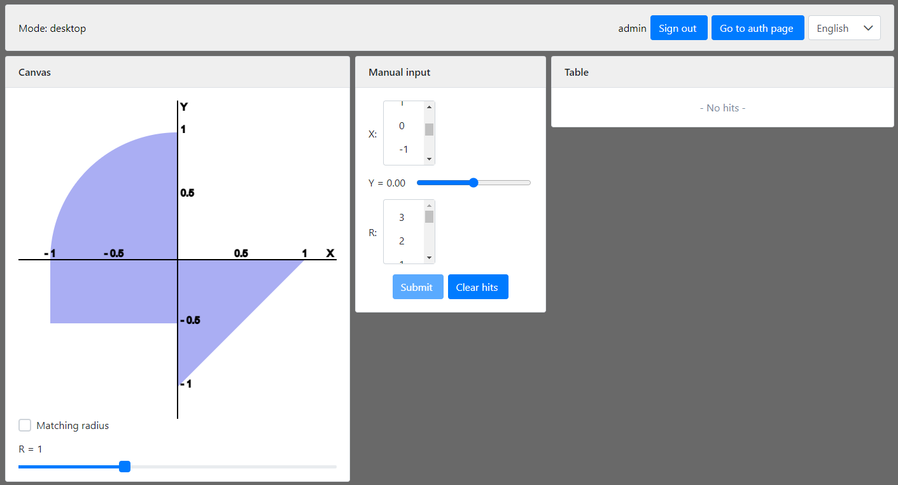
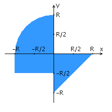

# Приложение-тир

### Описание

Итоговая лабораторная по вебу на 2 курсе ИТМО на программе "Программная инженерия". Фичи: REST, авторизация, адаптивный
дизайн, canvas.

### Технологии и фичи

- Backend: JavaEE
- Frontend: Angular + PrimeNG
- Oracle DB, JPA
- i18n
- Maven
- Hibernate Validator

Переписать приложение из предыдущей лабораторной работы с использованием следующих технологий:

- Уровень back-end должен быть основан на __Java EE (необходимо использовать EJB)__.
- Уровень front-end должен быть построен на __Angular 2+ с использованием набора компонентов PrimeNG__.
- Взаимодействие между уровнями back-end и front-end должно быть организовано посредством REST API.
- Приложение по-прежнему должно включать в себя 2 страницы — стартовую и основную страницу приложения.

Обе страницы приложения должны быть адаптированы для отображения в 3 режимах:

- "Десктопный" - для устройств, ширина экрана которых равна или превышает __1052__ пикселей.
- "Планшетный" - для устройств, ширина экрана которых равна или превышает __840__, но меньше __1052__ пикселей.
- "Мобильный"- для устройств, ширина экрана которых меньше __840__ пикселей.

Стартовая страница должна содержать следующие элементы:

- Шапку, содержащую ФИО студента, номер группы и номер варианта.
- Форму для ввода логина и пароля.
- Информация о зарегистрированных в системе пользователях должна храниться в отдельной таблице БД.
  (пароль должен храниться в виде хэш-суммы).
- Доступ неавторизованных пользователей к основной странице приложения должен быть запрещён.

Основная страница приложения должна содержать следующие элементы:

- Набор полей ввода для задания координат точки и радиуса области в соответствии с вариантом задания:
  __Listbox {'-5','-4','-3','-2','-1','0','1','2','3'}__ для координаты по оси X,
  __Slider (-5 ... 5)__ для координаты по оси Y, и __Listbox {'-5','-4','-3','-2','-1','0','1','2','3'}__
  для задания радиуса области. Если поле ввода допускает ввод заведомо некорректных данных (таких, например, как буквы в
  координатах точки или отрицательный радиус), то приложение должно осуществлять их валидацию.
- Динамически обновляемую картинку, изображающую область на координатной плоскости в соответствии с номером варианта и
  точки, координаты которых были заданы пользователем. Клик по картинке должен инициировать сценарий, осуществляющий
  определение координат новой точки и отправку их на сервер для проверки её попадания в область. Цвет точек должен
  зависить от факта попадания / непопадания в область. Смена радиуса также должна инициировать перерисовку картинки.
- Таблицу со списком результатов предыдущих проверок.
- Кнопку, по которой аутентифицированный пользователь может закрыть свою сессию и вернуться на стартовую страницу
  приложения.

Дополнительные требования к приложению:

- Все результаты проверки должны сохраняться в базе данных под управлением __СУБД Oracle__.
- Для доступа к БД необходимо использовать __JPA__.

#### Вопросы к защите лабораторной работы:

1. Платформа Java EE. Спецификации и их реализации.
1. Принципы IoC, CDI и Location Transpanency. Компоненты и контейнеры.
1. Управление жизненным циклом компонентов. Дескрипторы развёртывания.
1. Java EE API. Виды компонентов. Профили платформы Java EE.
1. Компоненты EJB. Stateless & Stateful Session Beans. EJB Lite и EJB Full.
1. Работа с электронной почтой в Java EE. JavaMail API.
1. JMS. Реализация очередей сообщений. Способы доставки сообщений до клиента. Message-Driven Beans.
1. Понятие транзакции. Управление транзакциями в Java EE. JTA.
1. Веб-сервисы. Технологии JAX-RS и JAX-WS.
1. Платформа Spring. Сходства и отличия с Java EE.
1. Модули Spring. Архитектура Spring Runtime. Spring Security и Spring Data.
1. Реализация IoC и CDI в Spring. Сходства и отличия с Java EE.
1. Реализация REST API в Java EE и Spring.
1. React JS. Архитектура и основные принципы разработки приложений.
1. Компоненты React. State & props. "Умные" и "глупые" компоненты.
1. Разметка страниц в React-приложениях. JSX.
1. Навигация в React-приложениях. ReactRouter.
1. Управление состоянием интерфейса. Redux.
1. Angular: архитектура и основные принципы разработки приложений.
1. Angular: модули, компоненты, сервисы и DI.
1. Angular: шаблоны страниц, жизненный цикл компонентов, подключение CSS.
1. Angular: клиент-серверное взаимодействие, создание, отправка и валидация данных форм.
